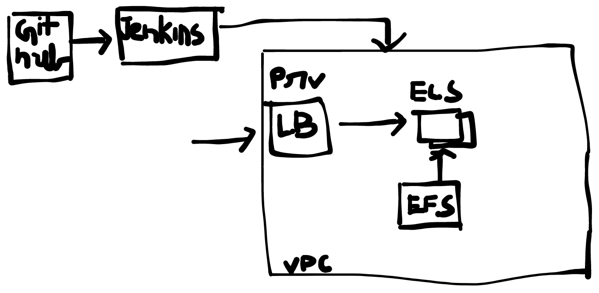

# Features to Implement

 - Add support to dockerise the wordpress and run /serve it with Apache and PHP ✅

 - Setup a pipeline to build the container when changes are pushed to the repository ✅

 - Setup a pipeline to deploy the freshly build container to Fargate ✅

 - Provision all the AWS resources you used via CloudFormation or Terraform or any other infrastructure as code framework ✅

 - Push all your code/repositories to GitHub for a review ✅
 
 ## Things to consider:

 - Data uploaded to wordpress (/wp-content/uploads/ ) must persists on EFS ✅

 - Instances of wordpress should horizontally scale to handle an increase in traffic

 - Use IAM best practices to ensure better security ✅

 - Store the database password in a secret so that no one has access to it. Expose the password to the wordpress container so that it can use it to connect to the database ✅

 # Setup details

 

`docker run -d -v jenkins_home:/var/jenkins_home -v  /var/run/docker.sock:/var/run/docker.sock -p 8080:8080 -p 50000:50000 --restart=on-failure jenkins:DID_1_1` 
